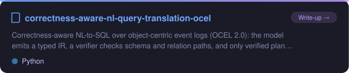
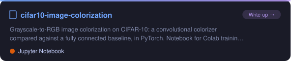
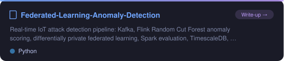
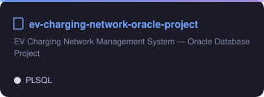
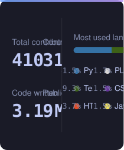
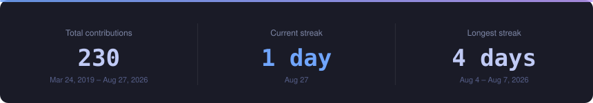
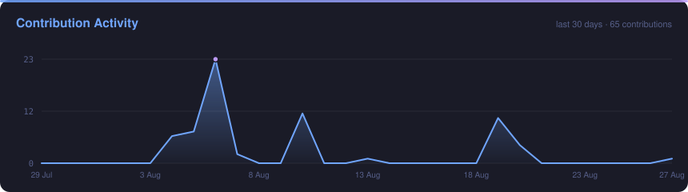
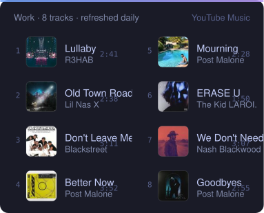

<div align="center">

<!-- Animated Header -->


<!-- Typing Animation -->


<br/>

<!-- Social Badges -->
<a href="https://www.linkedin.com/in/ouko-robert/"></a>
<a href="mailto:oukoor@gmail.com"></a>
<a href="https://music.youtube.com/@O_2wice"></a>
<a href="https://github.com/O-2wice"></a>

</div>

---

## About Me

I work on machine learning for enterprise data, mostly ERP and financial systems.

MSc Data Science at ELTE Budapest, after a BSc in Actuarial Science.

---

## Tech Stack

<div align="center">

<!--START_SECTION:tools-->
<a href="https://github.com/O-2wice?tab=repositories&language=python" title="Python"></a> <a href="https://github.com/O-2wice?tab=repositories&language=r" title="R"></a> <a href="https://www.postgresql.org/" title="PostgreSQL"></a> <a href="https://github.com/search?q=user%3AO-2wice%20is%3Apublic%20DuckDB&type=repositories" title="DuckDB"></a> <a href="https://github.com/search?q=user%3AO-2wice%20is%3Apublic%20Oracle&type=repositories" title="Oracle"></a> <a href="https://github.com/search?q=user%3AO-2wice%20is%3Apublic%20MongoDB&type=repositories" title="MongoDB"></a> <a href="https://www.elastic.co/elasticsearch" title="Elasticsearch"></a> <a href="https://pandas.pydata.org/" title="pandas"></a> <a href="https://numpy.org/" title="NumPy"></a> <a href="https://scikit-learn.org/" title="scikit-learn"></a> <a href="https://github.com/search?q=user%3AO-2wice%20is%3Apublic%20PyTorch&type=repositories" title="PyTorch"></a> <a href="https://www.tensorflow.org/" title="TensorFlow"></a>
<br/>
<a href="https://github.com/search?q=user%3AO-2wice%20is%3Apublic%20Apache%20Kafka&type=repositories" title="Apache Kafka"></a> <a href="https://github.com/search?q=user%3AO-2wice%20is%3Apublic%20Apache%20Flink&type=repositories" title="Apache Flink"></a> <a href="https://github.com/search?q=user%3AO-2wice%20is%3Apublic%20Apache%20Spark&type=repositories" title="Apache Spark"></a> <a href="https://www.sap.com/products/erp/s4hana.html" title="SAP S/4HANA"></a> <a href="https://www.microsoft.com/power-platform/products/power-bi" title="Power BI"></a> <a href="https://www.tableau.com/" title="Tableau"></a> <a href="https://xgboost.readthedocs.io/" title="XGBoost"></a> <a href="https://www.langchain.com/" title="LangChain"></a> <a href="https://www.docker.com/" title="Docker"></a> <a href="https://github.com/O-2wice?tab=repositories&language=jupyter+notebook" title="Jupyter"></a> <a href="https://git-scm.com/" title="Git"></a> <a href="https://www.kernel.org/" title="Linux"></a>
<!--END_SECTION:tools-->

</div>

---

## Featured Projects

<div align="center">

<a href="https://o-2wice.github.io/correctness-aware-nl-query-translation-ocel/"></a>
<a href="https://o-2wice.github.io/cifar10-image-colorization/"></a>
<br/>
<a href="https://github.com/O-2wice/Federated-Learning-Anomaly-Detection"></a>
<a href="https://github.com/O-2wice/ev-charging-network-oracle-project"></a>

</div>

| Project | Description | Tech Stack |
|---------|-------------|------------|
| [NL-to-SQL for ERP Systems](https://o-2wice.github.io/correctness-aware-nl-query-translation-ocel/) | Natural language query translation over enterprise event log data | LLM, DuckDB, Python |
| [Financial Risk Forecasting](https://github.com/O-2wice/DS_Lab_Project) | ML system for predicting financial distress using SAP S/4HANA data | XGBoost, SMOTE, SHAP, SAP |

---

## GitHub Stats

<div align="center">



<br/>

<!--START_SECTION:waka-->


📊 **This Week I Spent My Time On** 

```text
💬 Programming Languages: 
Other                    8 hrs 59 mins       ██████████████░░░░░░░░░░░   54.17 % 
Markdown                 5 hrs 58 mins       █████████░░░░░░░░░░░░░░░░   36.05 % 
Python                   45 mins             █░░░░░░░░░░░░░░░░░░░░░░░░   04.54 % 
TeX                      25 mins             █░░░░░░░░░░░░░░░░░░░░░░░░   02.53 % 
Git Config               23 mins             █░░░░░░░░░░░░░░░░░░░░░░░░   02.36 % 

🔥 Editors: 
Codex Vscode             8 hrs 43 mins       █████████████░░░░░░░░░░░░   52.57 % 
Claude Code              4 hrs 43 mins       ███████░░░░░░░░░░░░░░░░░░   28.50 % 
Codex CLI                2 hrs 52 mins       ████░░░░░░░░░░░░░░░░░░░░░   17.36 % 
Antigravity IDE          15 mins             ░░░░░░░░░░░░░░░░░░░░░░░░░   01.58 % 
```


 Last Updated on 28/08/2026 06:38:49 UTC
<!--END_SECTION:waka-->

<br/>



<br/>



<br/>

<picture>
  <source media="(prefers-color-scheme: dark)" srcset="https://raw.githubusercontent.com/O-2wice/O-2wice/output/github-snake-dark.svg" />
  <source media="(prefers-color-scheme: light)" srcset="https://raw.githubusercontent.com/O-2wice/O-2wice/output/github-snake.svg" />
  
</picture>

</div>

---

## Debug Soundtrack

What stays on while I code. Refreshed daily. Click through to open the playlist.

<a href="https://music.youtube.com/playlist?list=PLWJzcQJwrVbM">

</a>

---

## Daily Drivers

Forks I actually run, most recently touched first. Regenerated daily.

<!--START_SECTION:drivers-->
| Tool | What it does |
|------|--------------|
| [langgraph](https://github.com/O-2wice/langgraph) | Build resilient agents. |
| [bootdev](https://github.com/O-2wice/bootdev) | CLI used to complete coding challenges and lessons on Boot.dev |
| [pear-desktop](https://github.com/O-2wice/pear-desktop) | Pear 🍐 is extension for music player |
| [scrcpy](https://github.com/O-2wice/scrcpy) | Display and control your Android device |
| [MicaForEveryone](https://github.com/O-2wice/MicaForEveryone) | Mica For Everyone is a tool to enable backdrop effects on the title bars of Win32 apps on Windows 11. |
| [Sefirah](https://github.com/O-2wice/Sefirah) | Phone Link / KDE Connect alternative |
<!--END_SECTION:drivers-->

---

<div align="center">


<br/>


</div>
