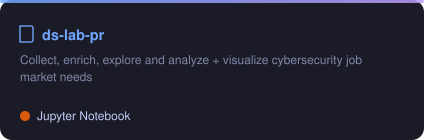

<div align="center">

<!-- Animated Header -->


<!-- Typing Animation -->


<br/>

<!-- Social Badges -->
<a href="https://www.linkedin.com/in/ouko-robert/"></a>
<a href="mailto:oukoor@gmail.com"></a>
<a href="https://music.youtube.com/@O_2wice"></a>
<a href="https://github.com/O-2wice"></a>

</div>

---

## About Me

I build machine learning systems on enterprise data.

Currently: natural language to SQL over ERP event logs, where the model emits a typed IR and only plans the verifier accepts compile to SQL. Also financial distress prediction on SAP S/4HANA.

MSc Data Science, ELTE Budapest.

---

## Tech Stack

<div align="center">

**Languages & Stats**<br/>
   

**ML & Modeling**<br/>
     

**Data & Streaming**<br/>
       

**Enterprise & Platform**<br/>
     

</div>

---

## Featured Projects

<div align="center">

<a href="https://github.com/O-2wice/Federated-Learning-Anomaly-Detection"></a>
<a href="https://github.com/O-2wice/cifar10-image-colorization"></a>
<br/>
<a href="https://github.com/O-2wice/ev-charging-network-oracle-project"></a>
<a href="https://github.com/O-2wice/ds-lab-pr"></a>

</div>

| Project | Description | Tech Stack |
|---------|-------------|------------|
| [NL-to-SQL for ERP Systems](https://github.com/O-2wice/correctness-aware-nl-query-translation-ocel) | Natural language query translation over enterprise event log data | LLM, DuckDB, Python |
| [Financial Risk Forecasting](https://github.com/O-2wice/DS_Lab_Project) | ML system for predicting financial distress using SAP S/4HANA data | XGBoost, SMOTE, SHAP, SAP |

---

## GitHub Stats

<div align="center">


<br/>

<!--START_SECTION:waka-->


**🐱 My GitHub Data** 

> 📦 ? Used in GitHub's Storage 
 > 
> 🏆 169 Contributions in the Year 2026
 > 
> 💼 Opted to Hire
 > 
> 📜 31 Public Repositories 
 > 
> 🔑 0 Private Repositories 
 > 
📊 **This Week I Spent My Time On** 

```text
💬 Programming Languages: 
Other                    10 hrs 40 mins      ███████████████░░░░░░░░░░   59.19 % 
Markdown                 4 hrs 9 mins        ██████░░░░░░░░░░░░░░░░░░░   23.06 % 
TeX                      1 hr 2 mins         █░░░░░░░░░░░░░░░░░░░░░░░░   05.79 % 
YAML                     56 mins             █░░░░░░░░░░░░░░░░░░░░░░░░   05.23 % 
Python                   52 mins             █░░░░░░░░░░░░░░░░░░░░░░░░   04.83 % 

🔥 Editors: 
Codex Vscode             8 hrs 53 mins       ████████████░░░░░░░░░░░░░   49.31 % 
Claude Code              7 hrs 29 mins       ██████████░░░░░░░░░░░░░░░   41.48 % 
Codex CLI                1 hr 23 mins        ██░░░░░░░░░░░░░░░░░░░░░░░   07.76 % 
Antigravity IDE          15 mins             ░░░░░░░░░░░░░░░░░░░░░░░░░   01.45 % 
```

**I Mostly Code in Python** 

```text
Python                   6 repos             █████████░░░░░░░░░░░░░░░░   35.29 % 
Jupyter Notebook         4 repos             ██████░░░░░░░░░░░░░░░░░░░   23.53 % 
HTML                     3 repos             ████░░░░░░░░░░░░░░░░░░░░░   17.65 % 
TeX                      2 repos             ███░░░░░░░░░░░░░░░░░░░░░░   11.76 % 
JavaScript               1 repo              █░░░░░░░░░░░░░░░░░░░░░░░░   05.88 % 
```


 Last Updated on 27/08/2026 01:55:07 UTC
<!--END_SECTION:waka-->

<br/>


<br/>


<br/>

<picture>
  <source media="(prefers-color-scheme: dark)" srcset="https://raw.githubusercontent.com/O-2wice/O-2wice/output/github-snake-dark.svg" />
  <source media="(prefers-color-scheme: light)" srcset="https://raw.githubusercontent.com/O-2wice/O-2wice/output/github-snake.svg" />
  
</picture>

</div>

---

## Debug Soundtrack

What stays on while I code. Refreshed daily. Click through to open the playlist.

<a href="https://music.youtube.com/playlist?list=PLWJzcQJwrVbM">

</a>

---

## Daily Drivers

Forks I actually run, most recently touched first. Regenerated daily.

<!--START_SECTION:drivers-->
| Tool | What it does |
|------|--------------|
| [bootdev](https://github.com/O-2wice/bootdev) | CLI used to complete coding challenges and lessons on Boot.dev |
| [pear-desktop](https://github.com/O-2wice/pear-desktop) | Pear 🍐 is extension for music player |
| [scrcpy](https://github.com/O-2wice/scrcpy) | Display and control your Android device |
| [MicaForEveryone](https://github.com/O-2wice/MicaForEveryone) | Mica For Everyone is a tool to enable backdrop effects on the title bars of Win32 apps on Windows 11. |
| [Sefirah](https://github.com/O-2wice/Sefirah) | Phone Link / KDE Connect alternative |
| [Fabric](https://github.com/O-2wice/Fabric) | Fabric is an open-source framework for augmenting humans using AI. It provides a modular system for solving specific problems using a crowdsourced set of AI prompts that can be used anywhere. |
<!--END_SECTION:drivers-->

---

<div align="center">


<br/>


</div>
